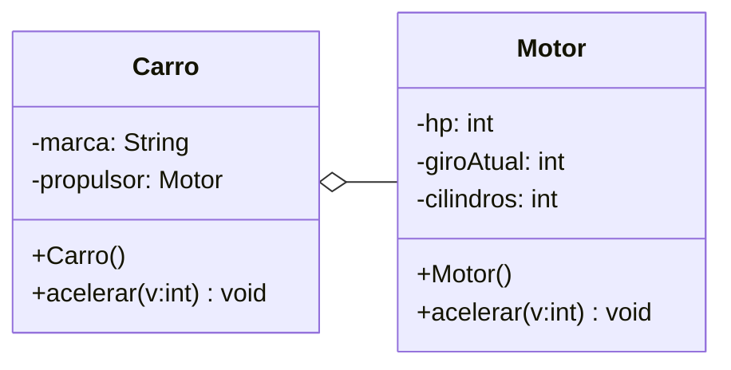

# Diagrama de classes UML

## Código java
```java
public class Pessoa{
    private String nome;
}
```


```mermaid
classDiagram
    direction LR
    Carro o-- Motor
    class Carro{
        -marca: String
        -propulsor: Motor
        +Carro()
        +acelerar(v:int) void
    }
    class Motor{
        -hp: int
        -giroAtual: int
        -cilindros: int
        +Motor()
        +acelerar(v:int) void
    }
```