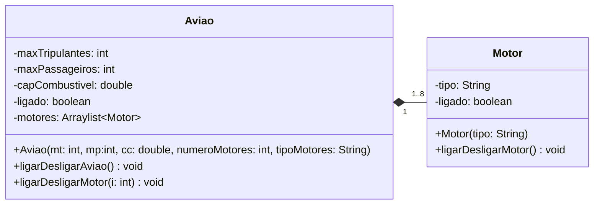

# Diagrama de classes UML

```mermaid
classDiagram
    direction LR
    Aviao "1"*--"1..8" Motor
    class Aviao{
        -maxTripulantes: int
        -maxPassageiros: int
        -capCombustivel: double
        -ligado: boolean
        -motores: Arraylist~Motor~
        +Aviao(mt: int, mp:int, cc: double, numeroMotores: int, tipoMotores: String)
        +ligarDesligarAviao()void
        +ligarDesligarMotor(i: int)void
    }
    class Motor{
        -tipo: String
        -ligado: boolean
        +Motor(tipo: String)
        +ligarDesligarMotor()void
    }
```