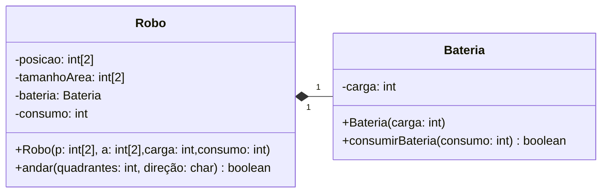

# Diagrama de classes UML

```mermaid
classDiagram
    direction LR
    Robo "1"*--"1" Bateria
    class Robo{
        -posicao: int[2]
        -tamanhoArea: int[2]
        -bateria: Bateria
        -consumo: int
        +Robo(p: int[2], a: int[2],carga: int,consumo: int)
        +andar(quadrantes: int, direção: char) boolean
    }
    class Bateria{
        -carga: int
        +Bateria(carga: int)
        +consumirBateria(consumo: int) boolean
    }
```