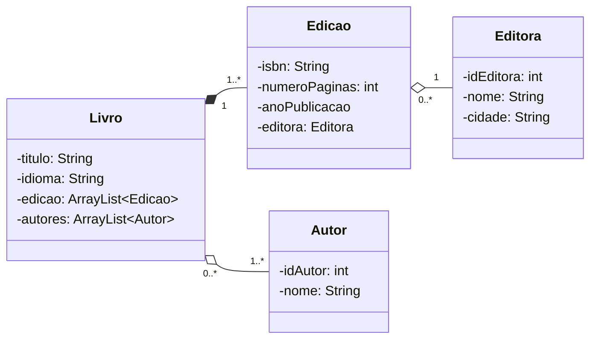
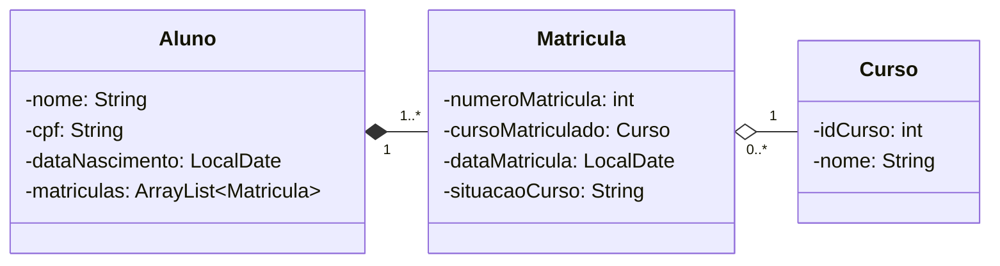
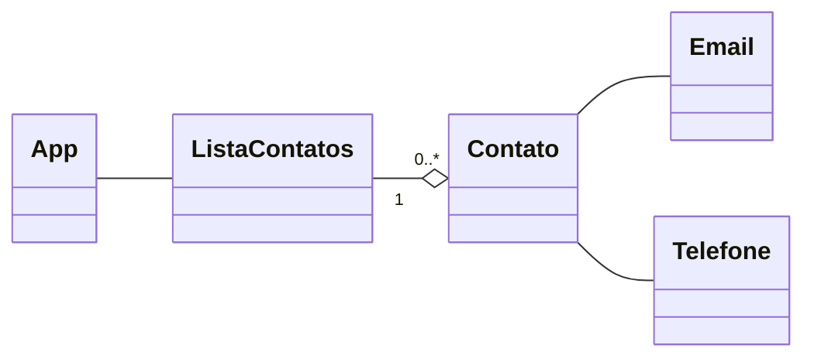

# Diagrama de classes UML

```mermaid
classDiagram
    direction LR
    Livro "1"*--"1..*" Edicao
    Edicao "0..*"o--"1" Editora
    Livro "0..*"o--"1..*" Autor
    class Livro{
        -titulo: String
        -idioma: String
        -edicao: ArrayList~Edicao~
        -autores: ArrayList~Autor~
    }
    class Editora{
        -idEditora: int
        -nome: String
        -cidade: String
    }
    class Autor{
        -idAutor: int
        -nome: String
    }
    class Edicao{
        -isbn: String
        -numeroPaginas: int
        -anoPublicacao
        -editora: Editora
    }
```

```mermaid
classDiagram
    direction LR
    Aluno "1"*--"1..*" Matricula
    Matricula "0..*"o--"1" Curso
    class Aluno{
        -nome: String
        -cpf: String
        -dataNascimento: LocalDate
        -matriculas: ArrayList~Matricula~
    }
    class Matricula{
        -numeroMatricula: int
        -cursoMatriculado: Curso
        -dataMatricula: LocalDate
        -situacaoCurso: String
    }
    class Curso{
        -idCurso: int
        -nome: String
    }
```

```mermaid
classDiagram
    direction LR
    App -- ListaContatos
    ListaContatos "1"--o"0..*" Contato
    Contato -- Email
    Contato -- Telefone
    class Contato{
        
    }
    class ListaContatos{
        
    }
    class Email{
        
    }
    class Telefone{
        
    }
    class App{
        
    }
```

