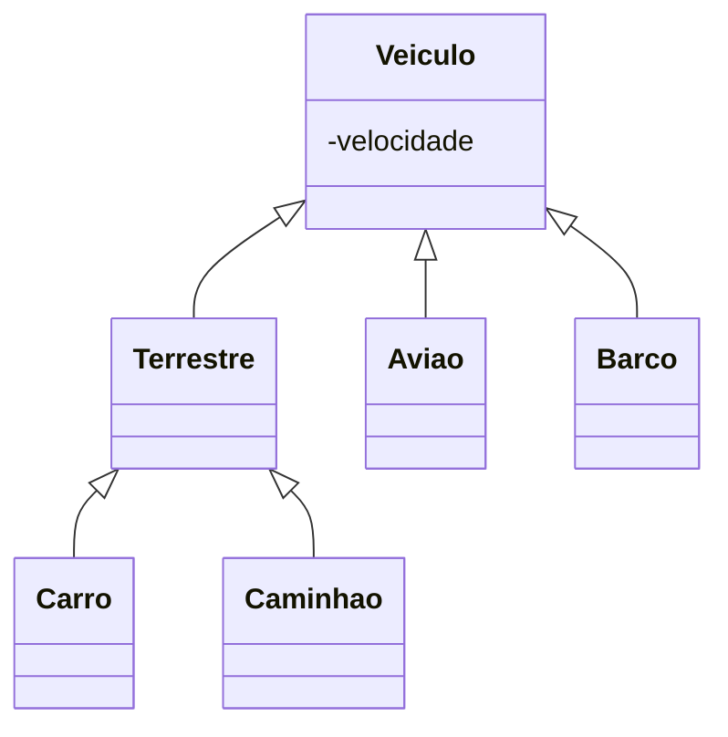
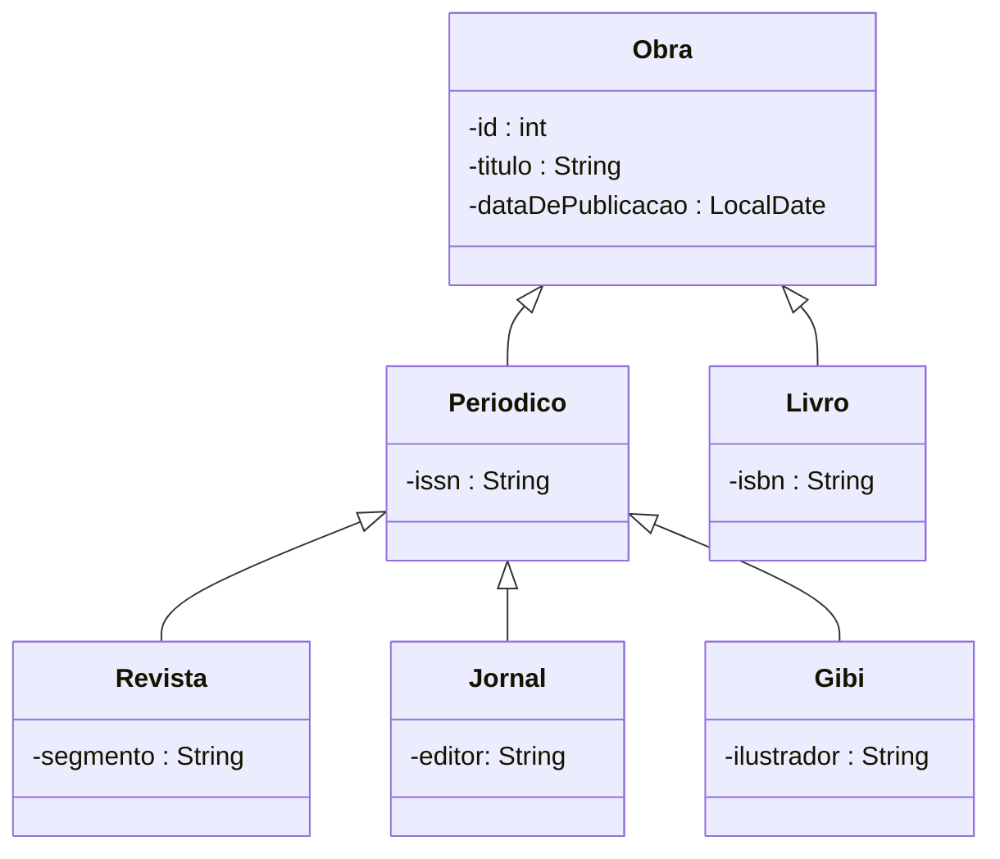
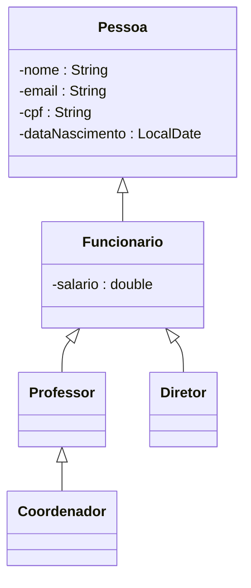

```mermaid
classDiagram
    class Veiculo {
        -velocidade
    }
    class Terrestre 
    class Caminhao
    class Carro
    class Aviao
    class Barco
    Veiculo <|-- Terrestre
    Terrestre <|-- Carro
    Terrestre <|-- Caminhao
    Veiculo <|-- Aviao
    Veiculo <|-- Barco
    
```

```mermaid
classDiagram
    class Obra {
        -id : int
        -titulo : String
        -dataDePublicacao : LocalDate

    }
    class Periodico {
        -issn : String
    }
    class Livro {
        -isbn : String
    }
    class Revista {
        -segmento : String
    }
    class Jornal {
        -editor: String
    }
    class Gibi {
        -ilustrador : String
    }

    Obra <|-- Livro
    Obra <|-- Periodico
    Periodico <|-- Revista
    Periodico <|-- Jornal
    Periodico <|-- Gibi
```

```mermaid
classDiagram
    direction BT
    
    class Pessoa {
        -nome : String
        -email : String
        -cpf : String
        -dataNascimento : LocalDate
    }
    class Professor
    class Coordenador
    class Diretor
    class Funcionario {
        -salario : double
        
    }
    
    Funcionario --|> Pessoa
    Professor --|> Funcionario
    Coordenador --|> Professor
    Diretor --|> Funcionario
```
