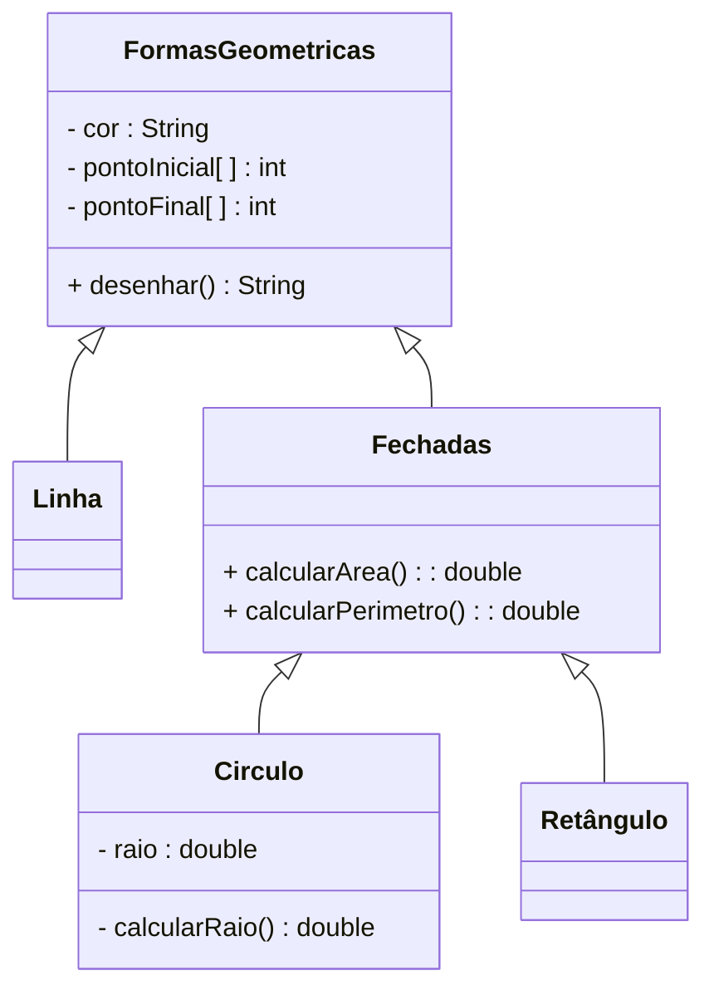
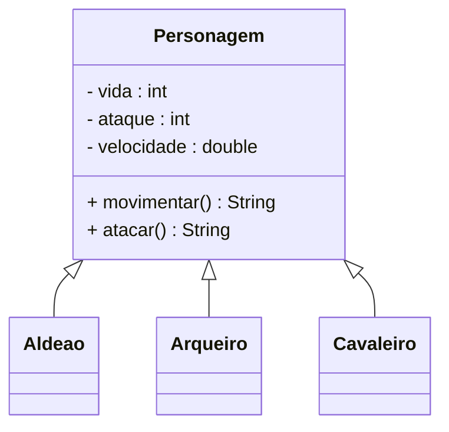

```mermaid
classDiagram
    class FormasGeometricas {
        - cor : String
        - pontoInicial[ ] : int
        - pontoFinal[ ] : int
        + desenhar() String
    }
    class Linha 
    class Fechadas {
        + calcularArea() : double
        + calcularPerimetro() : double
    }
    class Circulo {
        - raio : double
        - calcularRaio() double
    }
    class Retângulo
    
    FormasGeometricas <|-- Linha
    FormasGeometricas <|-- Fechadas
    Fechadas <|-- Circulo
    Fechadas <|-- Retângulo
```

```mermaid
classDiagram
    class Personagem{
        - vida : int
        - ataque : int
        - velocidade : double
        + movimentar() String
        + atacar() String
    }
    class Aldeao
    class Arqueiro
    class Cavaleiro
    
    Personagem <|-- Aldeao
    Personagem <|-- Arqueiro
    Personagem <|-- Cavaleiro
```