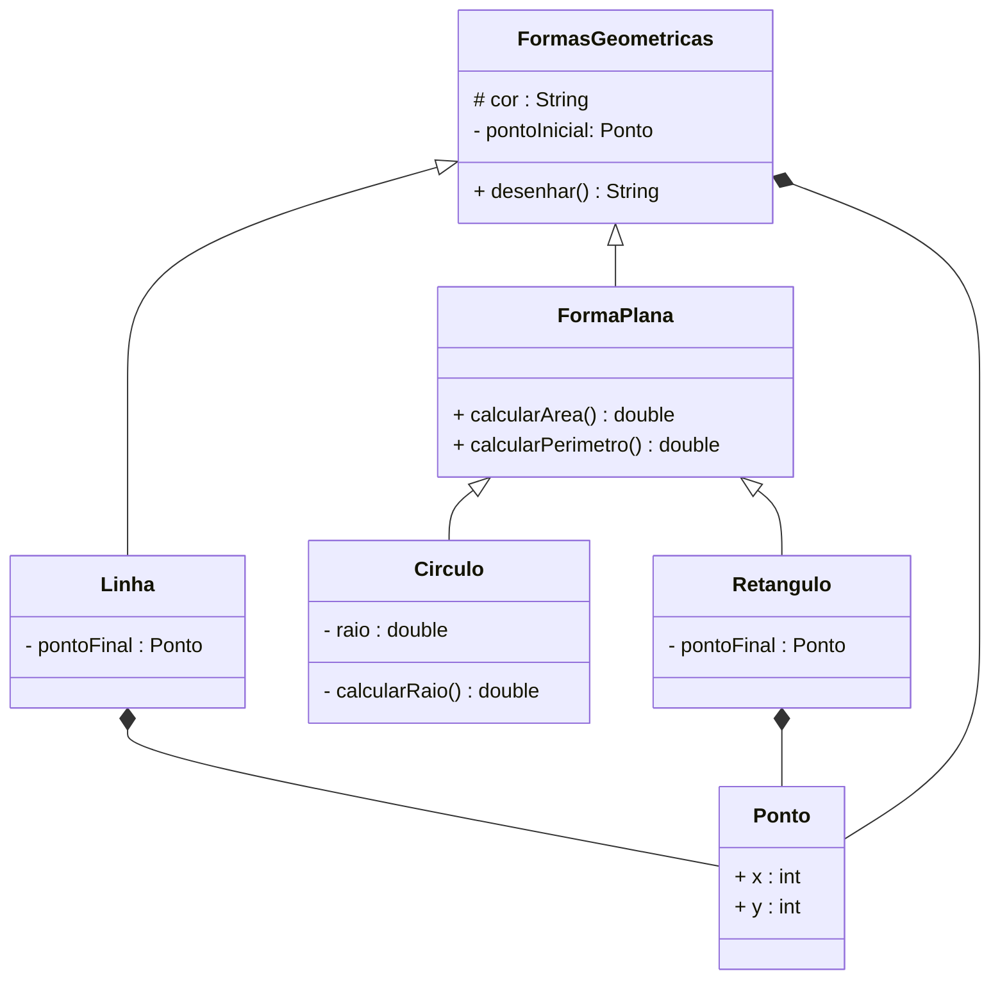
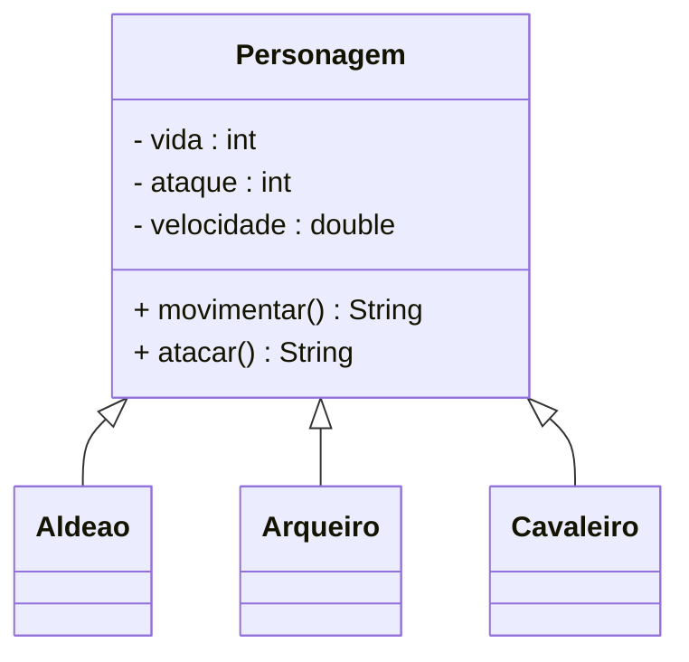

```mermaid
classDiagram
    class FormasGeometricas {
        # cor : String
        - pontoInicial: Ponto
        + desenhar() String
    }
    class Linha {
        - pontoFinal : Ponto
    }
    class FormaPlana {
        + calcularArea() double
        + calcularPerimetro() double
    }
    class Circulo {
        - raio : double
        - calcularRaio() double
    }
    class Retangulo {
        
        - pontoFinal : Ponto
    }
    class Ponto {
        + x : int
        + y : int
    }
    FormasGeometricas <|-- Linha
    FormasGeometricas <|-- FormaPlana
    FormaPlana <|-- Circulo
    FormaPlana <|-- Retangulo
    FormasGeometricas *-- Ponto
    Linha *-- Ponto
    Retangulo *-- Ponto
```

```mermaid
classDiagram
    class Personagem{
        - vida : int
        - ataque : int
        - velocidade : double
        + movimentar() String
        + atacar() String
    }
    class Aldeao
    class Arqueiro
    class Cavaleiro
    
    Personagem <|-- Aldeao
    Personagem <|-- Arqueiro
    Personagem <|-- Cavaleiro
```