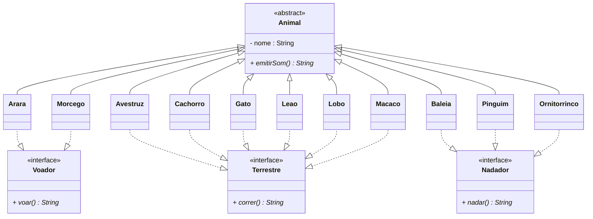

```mermaid
classDiagram
    direction BT
    class Animal{
        <<abstract>>
        - nome : String
        + emitirSom() String*
    }
    class Nadador{
        <<interface>>
        + nadar() String*
    }
    class Voador{
        <<interface>>
        + voar() String*
    }
    class Terrestre {
        <<interface>>
        + correr() String*
    }
    
    
    class Arara 
    class Avestruz
    class Baleia 
    class Cachorro
    class Gato
    class Leao
    class Lobo
    class Macaco 
    class Morcego
    class Pinguim
    class Ornitorrinco
    
    Arara --|> Animal
    Avestruz --|> Animal
    Baleia --|> Animal
    Cachorro --|> Animal
    Gato --|> Animal
    Leao --|> Animal
    Lobo --|> Animal
    Macaco --|> Animal
    Morcego --|> Animal
    Pinguim --|> Animal
    Ornitorrinco --|> Animal
    
    Terrestre <|.. Avestruz
    Terrestre <|.. Cachorro
    Terrestre <|.. Gato
    Terrestre <|.. Leao
    Terrestre <|.. Lobo
    Terrestre <|.. Macaco
    
    Voador <|.. Arara
    Voador <|.. Morcego
    
    Nadador <|.. Baleia
    Nadador <|.. Pinguim
    Nadador <|.. Ornitorrinco
```