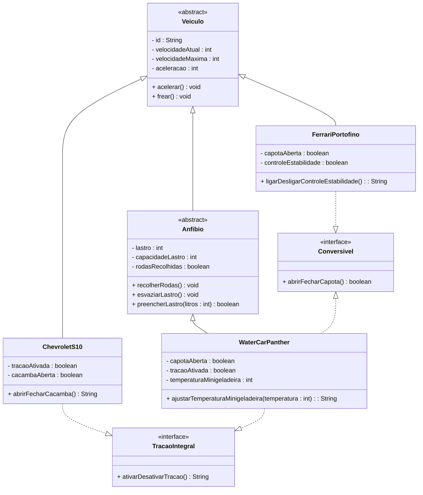

```mermaid
classDiagram
    class Veiculo{
        <<abstract>>
        - id : String
        - velocidadeAtual : int
        - velocidadeMaxima : int
        - aceleracao : int
        + acelerar() void
        + frear() void
    }
    class Anfibio{
        <<abstract>>
        - lastro : int
        - capacidadeLastro : int
        - rodasRecolhidas : boolean
        + recolherRodas() void
        + esvaziarLastro() void
        + preencherLastro(litros : int) boolean
    }
    class Conversivel{
        <<interface>>
        + abrirFecharCapota() boolean
    }
    class TracaoIntegral{
        <<interface>>
        + ativarDesativarTracao() String
    }
    class FerrariPortofino{
        - capotaAberta : boolean
        - controleEstabilidade : boolean
        + ligarDesligarControleEstabilidade() : String
    }
    class ChevroletS10 {
        - tracaoAtivada : boolean
        - cacambaAberta : boolean
        + abrirFecharCacamba() String
    }
    class WaterCarPanther{
        - capotaAberta : boolean
        - tracaoAtivada : boolean
        - temperaturaMinigeladeira : int
        + ajustarTemperaturaMinigeladeira(temperatura : int) : String
    }
    Veiculo <|-- Anfibio
    Veiculo <|-- ChevroletS10
    Veiculo <|-- FerrariPortofino
    Anfibio <|-- WaterCarPanther
    
    
    ChevroletS10 ..|> TracaoIntegral
    WaterCarPanther ..|> TracaoIntegral
    
    FerrariPortofino ..|> Conversivel
    Conversivel <|.. WaterCarPanther
    
```